# Your first schedule

From an empty window to a VEX file a correlator reads. No Python: everything here is done in
the application. About twenty minutes.

Every screenshot on this page is made from the application itself by
`tools/make_screenshots.py`, so what you see is what ships.

## Before you start

Install it and start it — [installing and running](installing.md) says how, and what the
command is called on your platform.

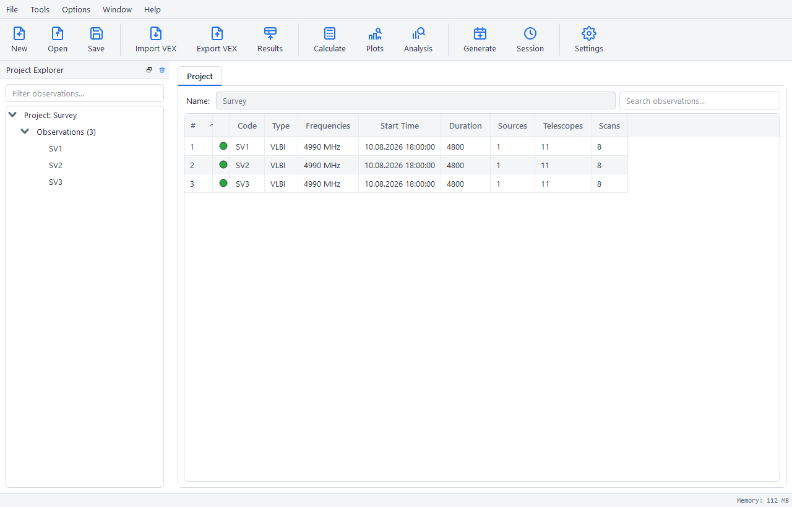

Three things are always there. The **project explorer** on the left lists what the project
holds. The **tabs** in the middle are what you are working on. The **status bar** at the
bottom says the last thing that happened, and what the process is holding.

## A project to put it in

**File → New Project**, or `Ctrl+N`.

A project is a directory rather than a file: the schedule goes in `project.json` and each
calculated result beside it. You are not asked where until you save, so nothing is written
before you have something to write.

## An observation

An observation is one experiment: a set of stations, sources and bands, and the scans that
point them. Right-click in the **Project** tab and choose **Add Observation**.

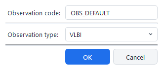

The **code** is what the file a correlator reads will call it, so give it the experiment's own
code. **VLBI** needs two stations to make a scan; **SINGLE_DISH** needs one.

Double-click the observation in the explorer to open it. It has four tabs: the stations, the
sources, the bands, and the scans that join them.

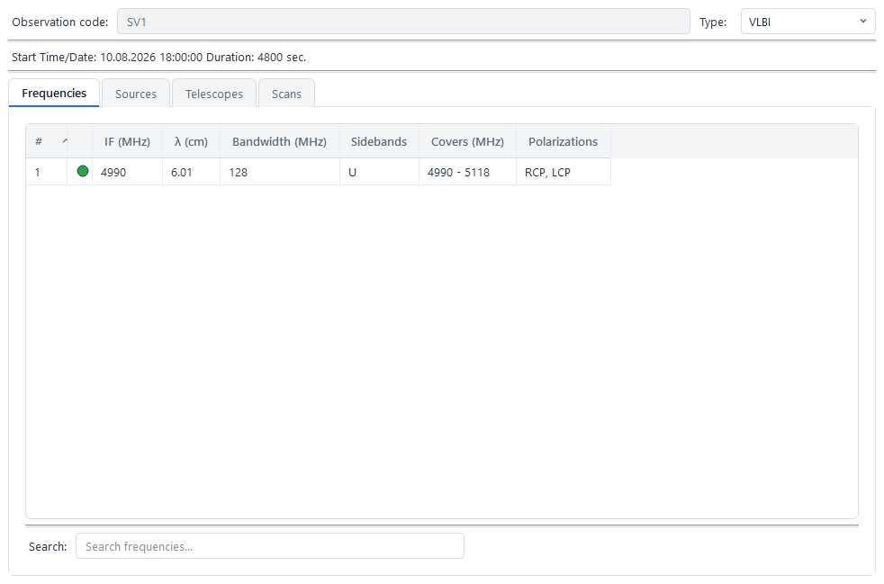

## The stations

Open the **Telescopes** tab, right-click, and choose **Add Telescope from Catalog**. The
shipped catalogue holds 246 stations.

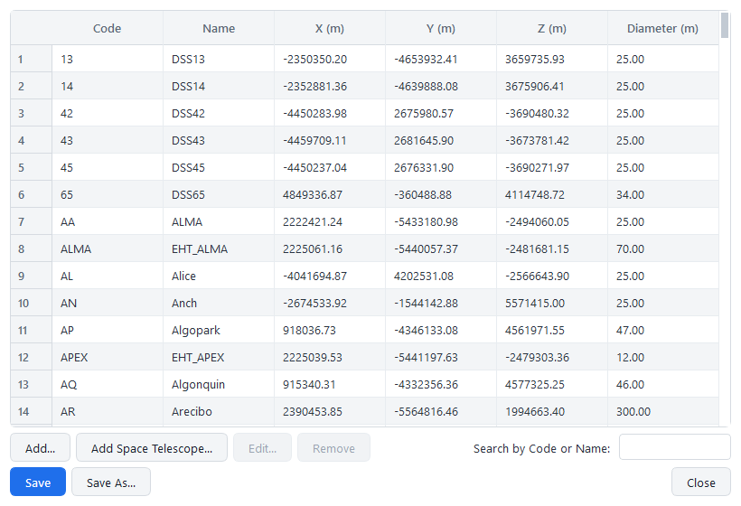

Pick what you need and add it. **Add Telescope** builds one by hand instead, and **Add Space
Telescope** one that follows an orbit rather than standing still.

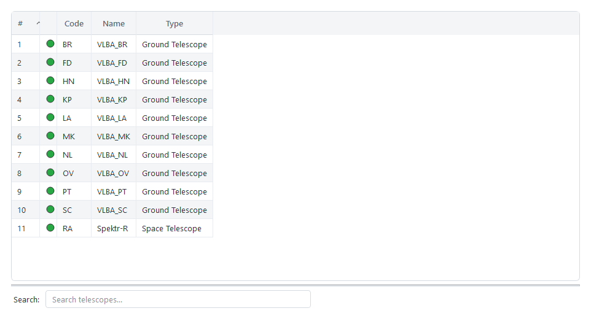

The green dot is the station being active in this observation. An inactive one stays in the
project and takes no part in a calculation, which is how you try an array without it.

## The source

**Sources → Add Source from Catalog**, the same way. The shipped catalogue holds 590.

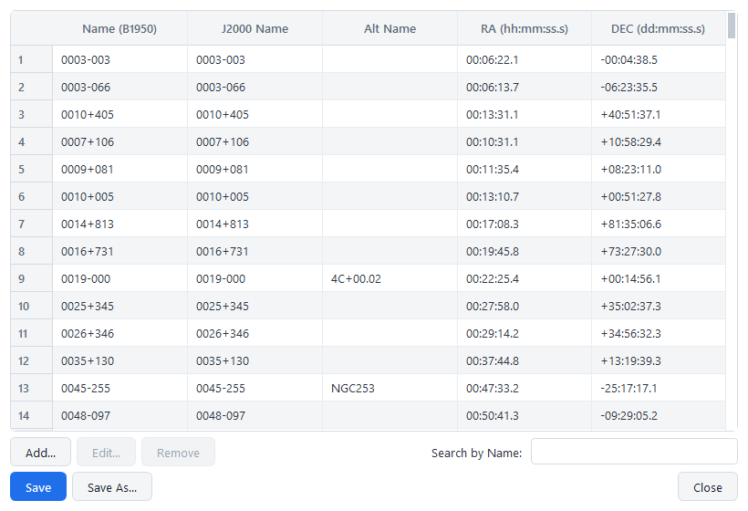

A source carries its position and, where it is known, its flux at measured frequencies. The
flux is what sensitivity is worked out against; without it a baseline reports no detection
rather than a guess.

## The band

**Frequencies → Add Frequency**.

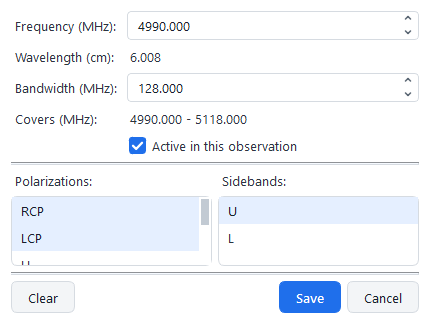

**Frequency** is an *edge*, not a middle, and **Covers** says the span it works out to while
you type. That matters: 4828 upper and 4844 lower are the same 16 MHz written two ways, and
the model refuses to hold both.

**Sidebands** and **polarizations** are lists, because one receiver setting records what it
records: both sidebands and both circular polarizations is four channels and still one band.

## The scan

**Scans → Add Scan**. A scan is the thing that joins the rest: this source, these stations,
these bands, from this moment, for this long.

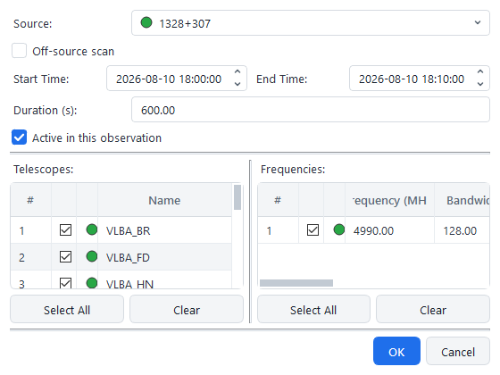

Set the **start** and the **duration**; the end follows. Moving the start moves the end and
leaves the length alone. Tick the stations and bands the scan uses.

**Active in this observation** is yours to decide. A scan that cannot be active — too few
stations, or a source the observation does not hold — cannot be ticked, and says so.

## Calculate

`Ctrl+R`, or **Tools → Calculate**.

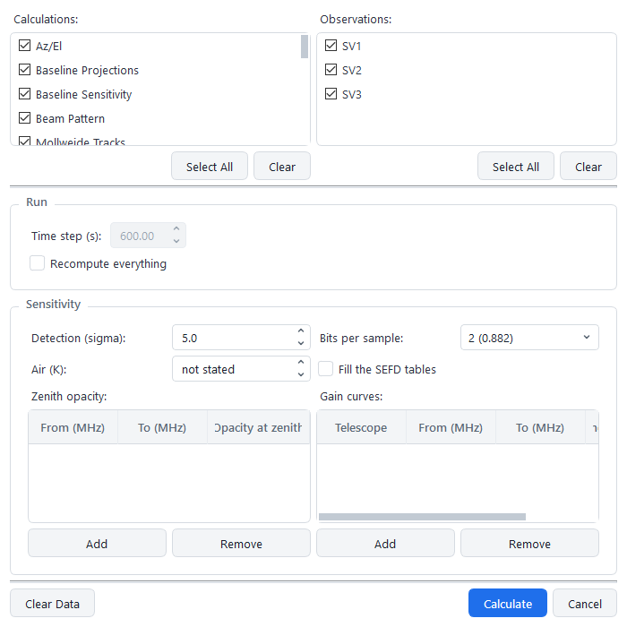

Tick what you want. You do not have to tick what those need: the backend works out the order
and adds the steps in between, so ticking telescope visibility alone runs the three underneath
it first.

**Time step** is the spacing between sampled moments, in seconds. The **Sensitivity** group is
asked for only when a calculation you ticked takes it — the weather and the gain curves are
assumptions of this run rather than properties of a station, so they go with the request.

## Look at it

`Ctrl+Shift+V`, or **Tools → Visualize**.

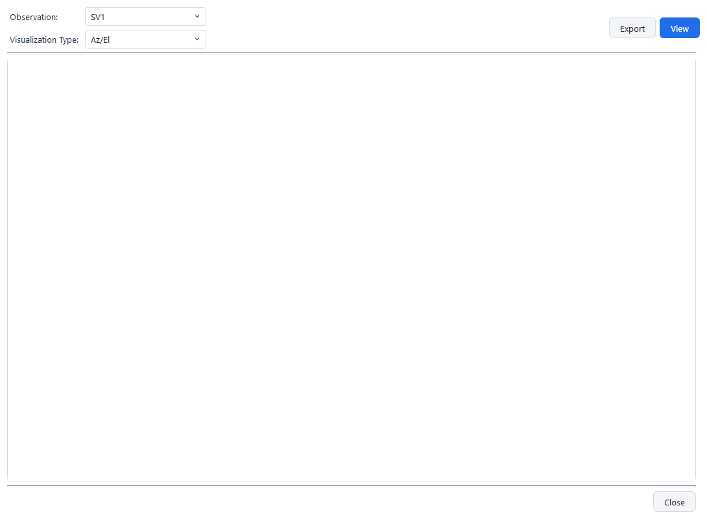

Each plot opens in its own tab with the filters it takes — sources, scans, stations,
baselines, bands. [What each plot shows](plots.md) says what is on each one.

To ask something of the numbers rather than look at them — when a source is up, for how long,
where the gaps are — `Ctrl+Shift+A` opens the [analysis tab](analysis.md).

## Write the file

**File → Export Observations → VEX...**, or `Ctrl+Shift+E`. **CFX** is beside it, and is what
the ASC correlator reads.

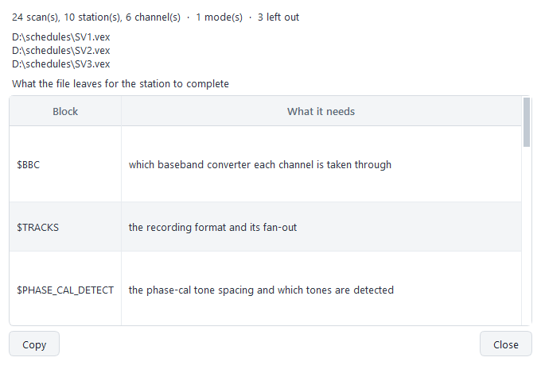

The file is complete in shape and partial in content, and that is deliberate. What the model
knows carries real values; what it cannot know — which recorder is in the rack this week,
which baseband converter a channel goes through — is written as an empty field or a
commented-out statement, annotated with what belongs there.

The report lists those blocks by name. A station or a correlator completes them, and
[getting a schedule to a correlator](formats.md) says which are whose.

## Save

`Ctrl+S`, and choose a folder. A save writes the schedule and every result beside it.

Results reach the disk the moment they are calculated, into a scratch directory belonging to
this session, so a crash costs you nothing. Saving moves them into the project; if a session
ends any other way, the next start offers them back.

## Where to go next

| | |
| --- | --- |
| [The calculations](calculations.md) | What each produces, what it needs, what makes it stale |
| [What each plot shows](plots.md) | The thirteen plots, and what to read off each |
| [Every tab and dialog](interface.md) | What each control does |
| [When something goes wrong](troubleshooting.md) | What a message means and what to do |
| [Asking something of the numbers](analysis.md) | Windows, gaps, coverage, statistics |
| [From a terminal](command-line.md) | The same requests without the window |
