# Every tab and dialog

What each screen is for and what its controls do. If you are making a schedule for the first
time, [your first schedule](first-schedule.md) walks the path instead.

Every screenshot here is made from the application by `tools/make_screenshots.py`.

## The window

| | |
| --- | --- |
| **File** | New, Open, Save, Save As; Import and Export Project, which are one file to send; Import and Export Observations, which are VEX and CFX; Recent Projects |
| **Tools** | Calculate, Visualize, Analyze, Export Calculated Data, Generate Observations, Session Viewer, Calculations Report |
| **Options** | Preferences, and the two catalogue browsers |
| **Window** | Show or hide the project explorer |
| **Help** | About |

The **toolbar** carries twelve of those actions. They are the menu's own, so one the window
disables is disabled in both places.

The **project explorer** on the left lists the project and its observations, with a filter
above it. Double-clicking an observation opens its tab. An observation whose results have gone
stale says how many.

The **status bar** shows the last line the log wrote, coloured by its level, and what the
process is holding. It is fed by the log rather than by each screen, so everything the
application reports reaches it.

## The tables, and what they share

Five screens are tables of model objects: the observations in a project, and the telescopes,
sources, bands and scans in an observation. They share one shape.

**The dot is activity.** Green is active and taking part; grey is held and ignored. An
inactive station stays in the project and out of the calculation, which is how you try an
array without it.

Right-click for the menu. Every table has the same family in the middle:

| | |
| --- | --- |
| **Activate All**, **Deactivate All** | Every row at once |
| **Drop Active**, **Drop Inactive** | Remove by activity, which is how a trial array is cleaned up |
| **Clear** | Remove everything |
| **Activate**, **Deactivate** | The row under the cursor |
| **Edit…**, **Remove…** | The row under the cursor |

**Search** hides rows rather than asking again. What you type is a substring and not a
pattern: a source named `0010+405` is found by typing it.

The **`#`** column is the row number and sorts on it; the rest sort on what they hold.

## The Project tab

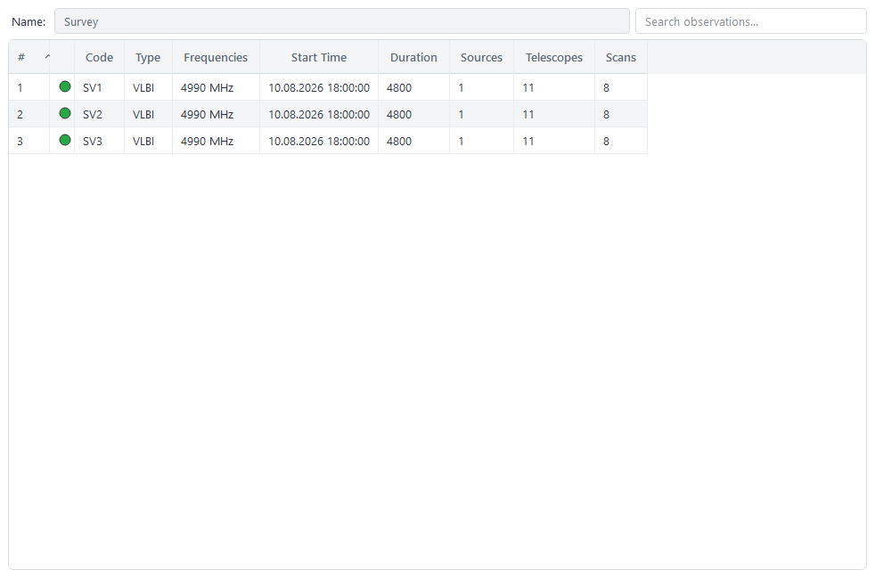

One row per observation: its code, type, bands, start, duration, and how many sources,
telescopes and scans it holds. **Name** at the top is the project's own.

Its menu adds **Add Observation** and **Import New Observation**. Removing an observation
leaves its results on disk until the next save.

## An observation

The code and the type at the top, then four tables. A code is unique in a project: renaming
one onto another's code is refused.

### Telescopes

**Add Telescope from Catalog** takes one from the 246 shipped; **Add Telescope** and **Add
Space Telescope** build one by hand. **Import New Telescope** reads a file written by **Export
Telescope**, and gives it the first free name and code, so a station the observation already
holds can be imported beside it.

### Sources

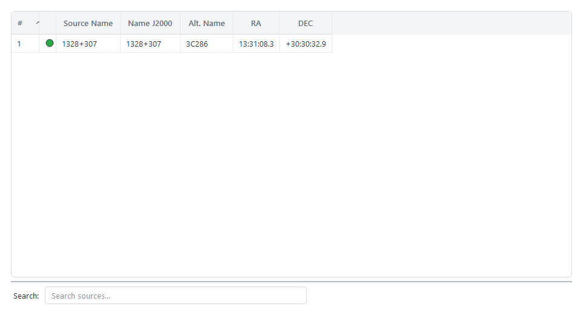

**Add Source from Catalog** takes one of the 590 shipped. The position is shown as the source
answers it, in hours and arcseconds.

### Frequencies

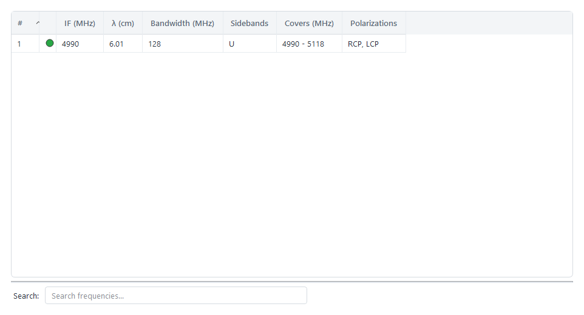

One row per band. **Covers** is the span the frequency and bandwidth work out to, which is the
column that makes two rows recognisable as the same piece of spectrum.

### Scans

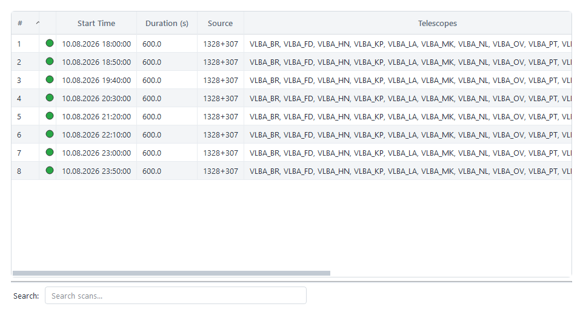

One row per scan: when it starts, how long, the source, and how many stations and bands. A
scan that cannot be active — too few stations for the kind of observation, or a source the
observation does not hold — cannot be ticked.

## The analysis tab

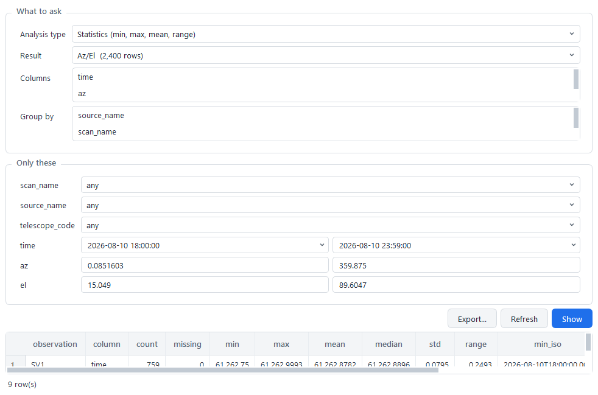

**Analysis type** is the question; **Result** is what to ask it of. The columns, what may be
grouped by, and the filters under **Only these** are all read from the result itself, so a
calculation added later appears here with its own columns.

Every numeric filter opens filled with the span that is actually there, which turns filtering
into narrowing. A moment is a calendar reading `yyyy-MM-dd HH:mm:ss`. **Show** asks;
**Export…** writes what is on screen. [Asking something of the numbers](analysis.md) says what
each question answers.

## The editors

### A telescope

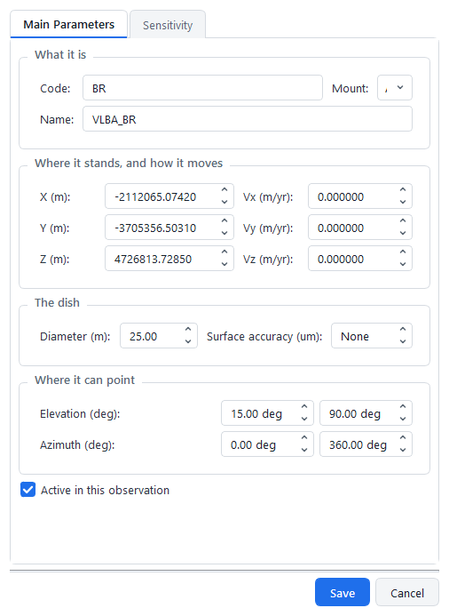

**Main Parameters** is four groups: what it is, where it stands and how it moves, the dish,
and where it can point. **Velocities are metres per year**, which is what VEX and CFX write
and what a station's drift is quoted in.

**Sensitivity** holds four tables of measurements: SEFD, system temperature, aperture
efficiency and effective area. A row is `from`, `to`, `value` — what was measured and the
range it holds for, so a temperature measured at C band is never taken as the one at 22 GHz.

### A space telescope

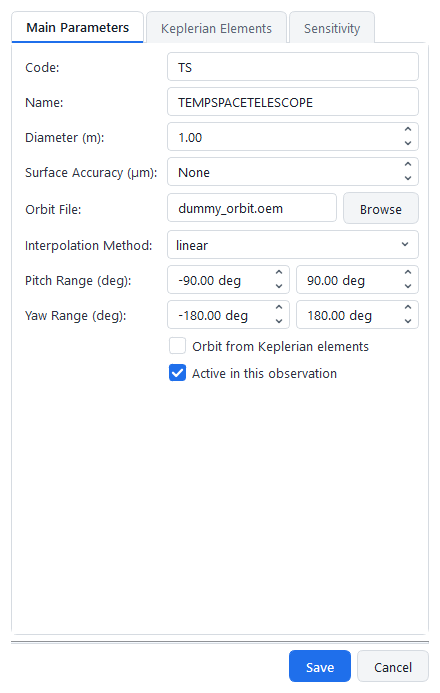

The same measurements, and an orbit instead of a position: **Browse** for an orbit file, or
**Orbit from Keplerian elements** for the six and an epoch. Pitch and yaw ranges stand in for
a mount.

### A source

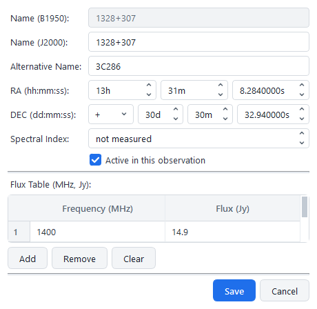

Right ascension and declination in parts, with the sign its own field — a declination between
-1 and 0 degrees keeps its sign in a negative zero, which a number box cannot show.

The flux table is `from`, `to`, `value` like a station's. **Spectral index** reaches beyond
the measured frequencies; its lowest value reads "not measured", because zero is a flat
spectrum rather than the absence of one.

### A band

**Frequency** is an edge rather than a middle, and **Covers** says the span while you type.
**Sidebands** and **polarizations** are lists: one setting with both sidebands and both
circular polarizations is four channels and still one band.

The lists are filled from the model, so the form cannot offer a polarization the model would
refuse — circular mixed with linear, for instance.

### A scan

Start and duration are the two free fields; the end follows, and moving the start moves the end
without changing the length. **Off-source scan** points at nothing and switches the source off.

Tick the stations and the bands the scan uses. **Active in this observation** is yours to set,
and is read as you leave it.

## The operation dialogs

### Calculate

Tick calculations on the left and observations on the right. What a ticked calculation needs is
added by the backend, in the order that satisfies it.

**Time step** is the spacing between sampled moments. **Recompute everything** forces what is
current as well as what is stale, which is for a change in a calculation rather than in the
model. **Clear Data** throws the selected observations' results away, and asks first.

The **Sensitivity** group is offered only beside a calculation that takes it. **Fill the SEFD
tables** writes a computed SEFD into the station it was computed for, over the band, and never
over a measurement.

### Plots

Choose the observation and the plot; **View** opens it in a tab with the filters it takes.
Only a plot the observation has results for is offered. **Export** writes the rows behind the
plot as a text table. [What each plot shows](plots.md) goes through the thirteen.

### Export Calculated Data

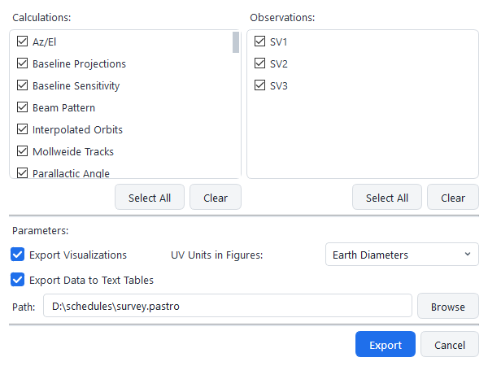

Writes results out: **Export Data to Text Tables** as tab-separated files, **Export
Visualizations** as pictures. **UV Units in Figures** is what a baseline is measured in on the
two plots that draw one — wavelengths or Earth diameters.

Everything is offered, including the steps other calculations need. Choosing what to *compute*
leaves those out, because nobody asks for them by name; choosing what to *write out* does not.

### Generate Observations

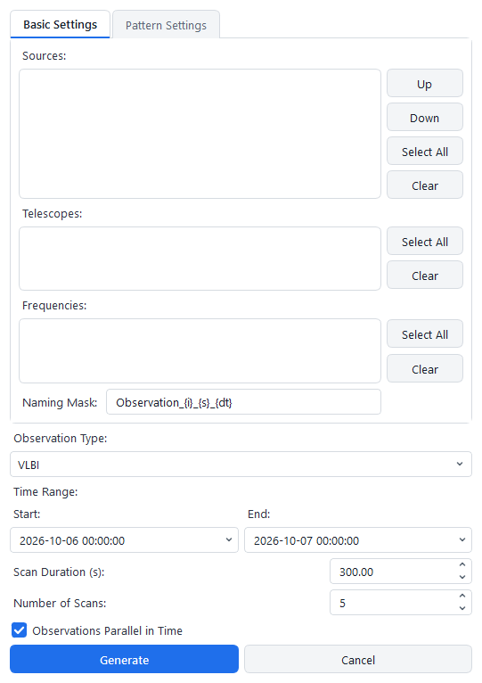

Builds many observations from one pattern. **Basic Settings** is what they are made of —
sources, stations and bands, and the **naming mask** the codes are built from. One observation
is made per source, which is why the sources can be reordered.

**Pattern Settings** is the timing: the span, the scan length, how many, and the interval
between them. **Observations Parallel in Time** starts them all together instead of one after
another; **Add Off-Source Scans** puts a calibration scan beside each.

**Preset** offers the patterns the model names. **Save Plan…** and **Load Plan…** keep the
whole of it — what is selected as well as the timing — so a plan comes back able to generate.

### Session Viewer

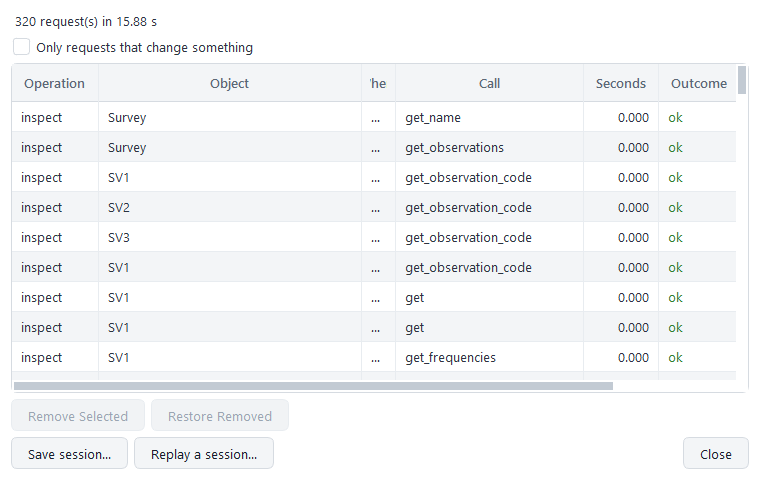

Every request this session has made: the operation, the object, what was called, how long it
took and whether it worked.

**Only requests that change something** hides the questions. **Remove Selected** leaves rows
out and **Restore Removed** brings them back; **Save session…** writes what is shown.
**Replay a session…** runs a saved one against the project in hand, and checks the whole of it
before running any of it.

### Calculations Report

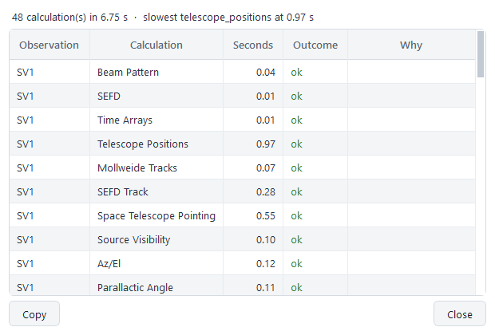

What the last run did: a row per observation and calculation, with the seconds it took, whether
it worked, and **Why** where it did not. A refused step says why here rather than only in the
log.

The line above says how many ran, how long on the clock, and which was slowest. Where
independent steps ran together the work adds up to more than the clock, and both are shown.

### Export Schedule

Shown after writing VEX or CFX: what went into the file, and the blocks it leaves for a station
or a correlator to complete. **Copy** takes the report to the clipboard.

### The catalogue browsers

**Options → Source** or **Telescope Catalog Browser**. Add, edit and remove entries, and
**Save** or **Save As…** to a file of your own. An edit takes effect at once, so the generator
and every "Add from Catalog" see it in this session.

The shipped catalogues are never written over: saving one asks for a name beside your settings,
and the setting then follows your file.

### Preferences

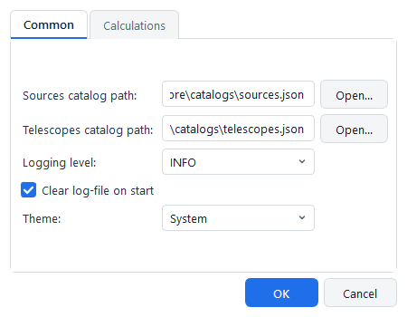

**Common** holds the two catalogue paths, the logging level, whether the log is cleared on
start, and the theme — **System**, **Light** or **Dark**.

**Calculations** holds the default time step, and what share of available memory the results
in hand may occupy before the least recently used are dropped. A dropped result is read back
from the project when it is next wanted, so the ceiling costs a read rather than a run.

### Progress

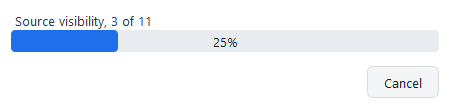

Shown for work that takes time: calculating, exporting, generating, saving. Escape and the
close button ask to cancel rather than closing; the window closes when the work reports back.

A long message is shortened in the middle, with the whole of it as the tooltip. Work that
cannot be stopped half way, such as a save, has no Cancel.

### About

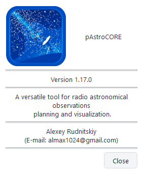

The version, which is read from the package rather than written into the form.
