# What each plot shows

Thirteen plots, each reading one calculated result. **Tools → Visualize**, or `Ctrl+Shift+V`,
opens the chooser; **View** puts one in a tab of its own.
[The calculations](calculations.md) says what produces each result.

Every screenshot here is made from the application by `tools/make_screenshots.py`, against the
example schedule it builds: the VLBA and Spektr-R on three calibrators, at 6 cm.

## What every tab has

Only a plot the observation has results for is offered. Choosing one opens a tab, and the tabs
stay open behind each other, so two can be compared by clicking between them.

The filters down the right are read from the result itself rather than from the model: the
stations listed are the stations that produced rows. **Select All** and **Clear** under each
list tick the whole of it and redraw once.

A scan is listed by when it starts, because two scans of one source are told apart by time. The
toolbar above the plot is matplotlib's own: pan, zoom, and a save button that writes a picture.

**Unticking everything in a list empties the plot.** The panel goes blank rather than showing
empty axes, which is [what to expect](troubleshooting.md) and what the roadmap's G14 is about.

## Where the stations point

### Az/El

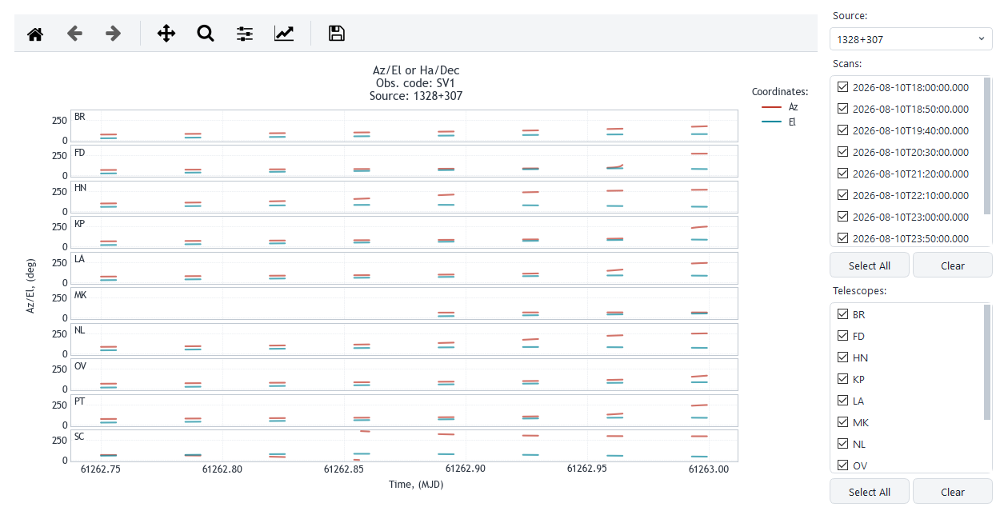

A panel per station: azimuth in one colour, elevation in the other, against time in MJD. The
station's code sits inside its own panel.

A line breaks where there is nothing to join — where azimuth wraps past 360, and where the
source was below the horizon. A station that picks the source up late starts late, which is
what MK does here.

The title reads *Az/El or Ha/Dec* because the visualizer draws either pair. This tab asks for
azimuth and elevation.

### Parallactic angle

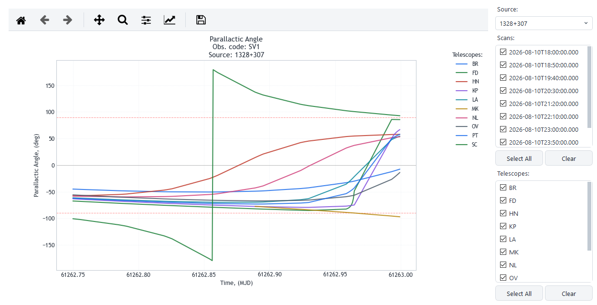

One line per station, in degrees. The grey line is zero and the two red dashes are ±90, which
is where a feed's orientation on the sky has turned a right angle.

A line that jumps the full height of the plot has wrapped through ±180 rather than moved. SC
does it here, half way through the night.

### Sun angles

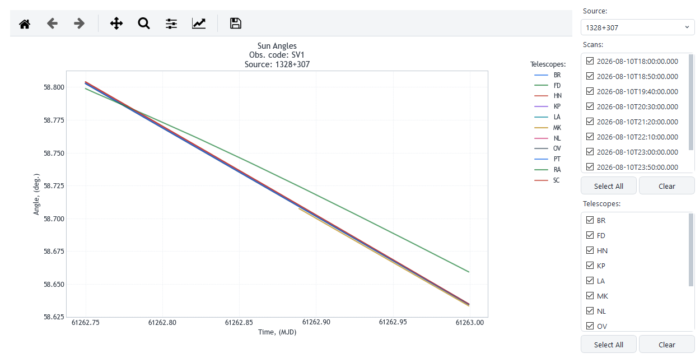

How far the source is from the Sun, per station, in degrees. The stations barely differ, the Sun
being far enough away that a baseline does not change the angle much.

This is the plot to look at before a daytime observation: what counts as too close is the
receiver's business, and the number is here to be compared against it.

### Mollweide tracks

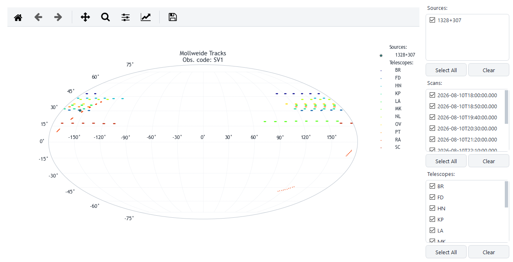

The whole sky on one ellipse. Each dotted track is where a station's zenith points as the Earth
turns; the star is the source.

The closer a track passes to the star, the higher the source stands over that station. A
spacecraft's track crosses the sky on its own schedule, which is why RA's is nothing like the
rest.

### Time on source

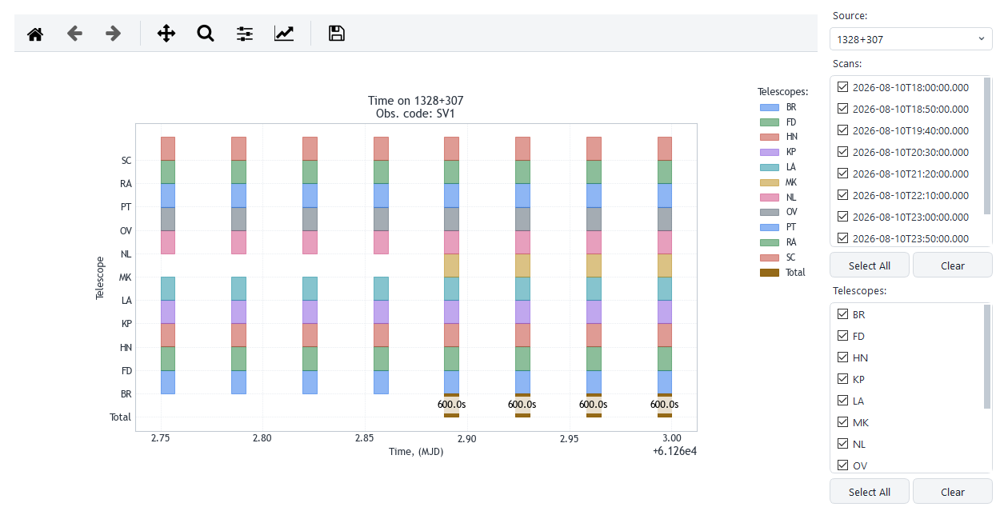

A row per station and a **Total** row underneath. A block is a stretch the station had the
source, and its length is the time that counts.

The Total is the time every ticked station had it at once, which is what a baseline is
correlated over. It is labelled in seconds where there is room for the number.

## What the array samples

### UV coverage

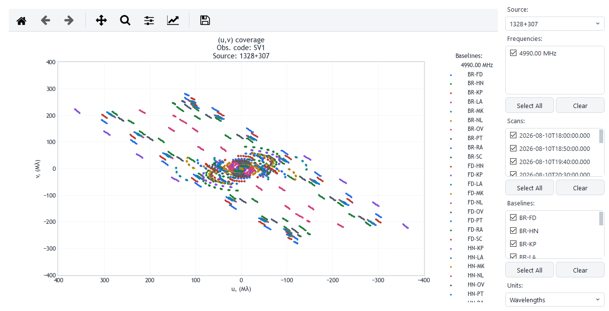

The uv plane: each point is one baseline at one moment, and the pattern is what the array
samples of the source's structure. Points come in pairs about the origin, a baseline being
measured both ways.

**u runs to the left**, as a uv plot is drawn everywhere: east is that way when the sky is
looked at rather than stood on.

**Units** switches between wavelengths and Earth diameters. A space baseline runs off the scale
a ground array sets, which is the point of having one.

Unticking baselines is how a plot of fifty-five becomes readable.

### Baseline projections

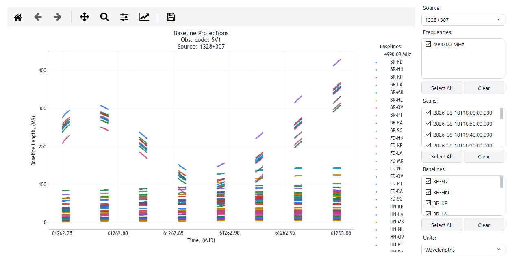

The same baselines as lengths against time. The spread at one moment is the range of scales the
array is sensitive to then, and a line that climbs is a baseline opening up as the Earth turns.

## Sensitivity

### SEFD

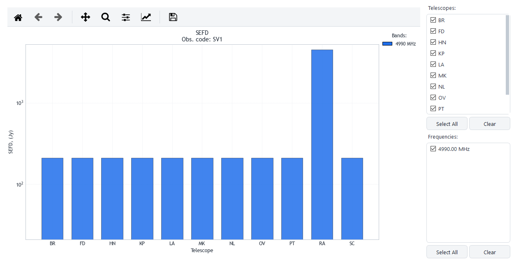

A bar per station and band, on a log scale. A plain bar was measured; a hatched one was computed
from the station's temperature and dish, and the legend says so.

A station with nothing to go on gets no bar and the words *no SEFD* where it would have stood.
The axis starts a decade under the smallest bar, so an array of alike antennas is still read.

### SEFD track

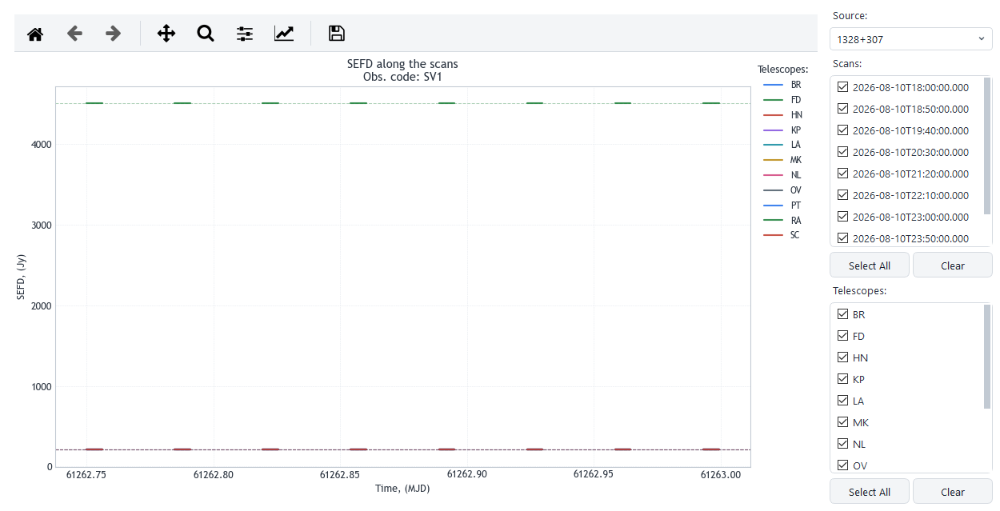

What each station's SEFD is along the scans, drawn per scan so nothing is joined across a slew.
The faint dashed line behind a station's is its zenith SEFD, and the distance between the two is
what the elevation costs.

Flat lines mean no atmosphere was given. Opacity, air temperature and a gain curve go with the
calculation rather than with the station, so a track without them is the zenith value held
level.

### Baseline sensitivity

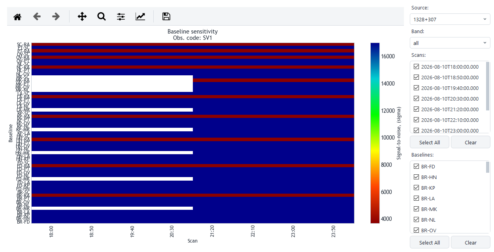

A grid of baselines by scans, coloured by the signal-to-noise that pair reaches on that scan.
Red is the poor end. A black cross marks a cell under the detection threshold, and the colour
bar carries a black line at the threshold itself.

**Band** draws one band, or `all` of them together, where signal-to-noise adds in quadrature. A
white cell is a pair that never saw the source together.

The colour bar is logarithmic only where the values span more than a decade.

## The dish itself

### Beam pattern

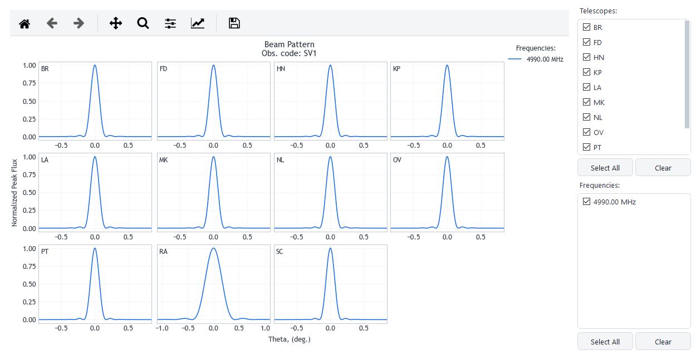

A panel per station: the normalised response against angle from the pointing direction. A
smaller dish has a wider beam, which is why RA's panel is drawn on a wider angle than the rest.

The frequency list here comes from the observation rather than from the result, so a beam can be
drawn at a frequency nothing was calculated at.

## Pointing at a spacecraft

Both of these need a space telescope in the observation and a target chosen when calculating.
They are about a ground station tracking a spacecraft, which is not the geometry of pointing at
a source.

### Space telescope pointing

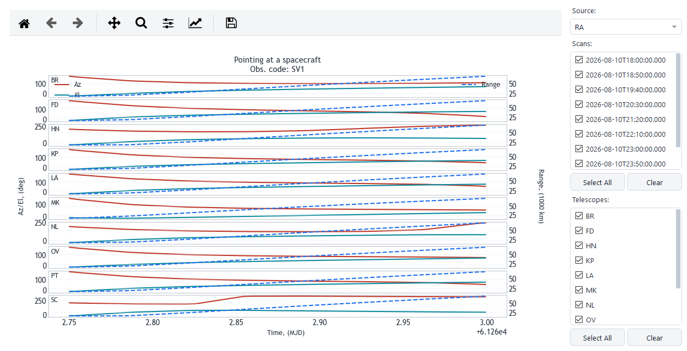

A panel per station again, with azimuth and elevation on the left axis and the distance to the
spacecraft on the right, in thousands of kilometres. The dashed line is the range.

### Space telescope visibility

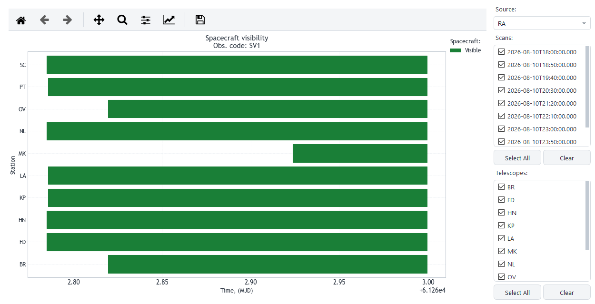

A band per station, filled where the spacecraft is above that station's horizon and inside its
limits. Where the bands overlap is when the spacecraft can be tracked by more than one.

## Writing them out

**Export** beside the chooser saves the result behind a plot as a tab-separated file, with the
columns [the calculations](calculations.md) lists. The toolbar's save button writes the picture
instead.

To write every plot of every observation at once, **Tools → Export Calculated Data** does both
pictures and tables; [every tab and dialog](interface.md) says what it offers.
